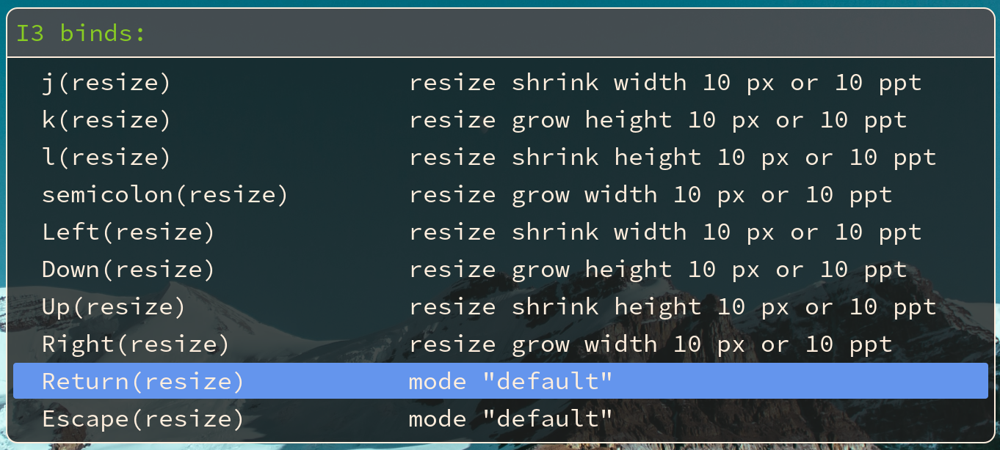

# rofi-i3-keybinds-cheatsheet
A very simple script to show all the keybinds with mode hint in rofi

## useage
	```shell
		keybinds_cheatsheet.sh [./path/to/your/i3/script] [padding]
	```
### example
	```shell
		keybinds_cheatsheet.sh ~/.config/i3/config 30
	```	
you can make a keybind to this script in your i3 config
	```shell
		bindsym [keybinds] exec --no-startup-id /path/to/keybind_cheatsheet.sh [i3config path] [padding]
	```
	
